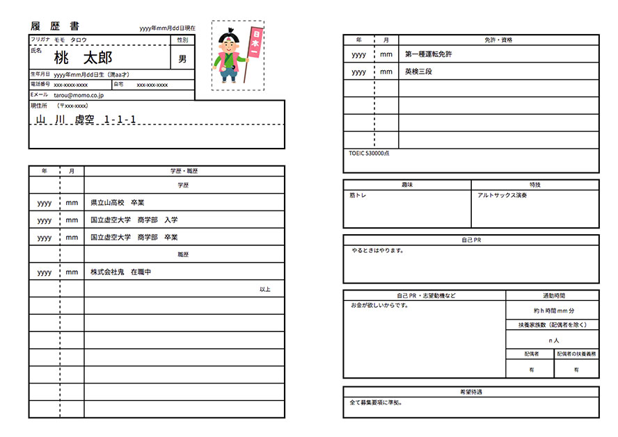

# resume
japanese traditional resume/cv on web.


## contains
- [x] Yarn
- [x] PostCSS
 - [x] autoprefixer
 - [x] postcss-custom-properties
 - [x] postcss-import
 - [x] postcss-nested
 - [x] stylelint
 - [x] stylefmt
- [x] Browsersync

## development

```sh
yarn install   # Init

yarn css       # Build css
yarn w-css     # Watch css
yarn lint-css  # Lint css

yarn serve     # Edit start while w-css and autoreload on localhost:3000

yarn build     # Build resume in dist/
yarn deploy    # Build and Deploy to gh-pages
```
and also you can deploy to heroku.

## concept
it is supposed to be printed as well as web browsing. please try printing directly using the print function of various web browsers.

> Web ブラウジングだけでなく、印刷されることも想定しています。各種 Web ブラウザーの印刷機能を使って直接印刷してみて下さい。
